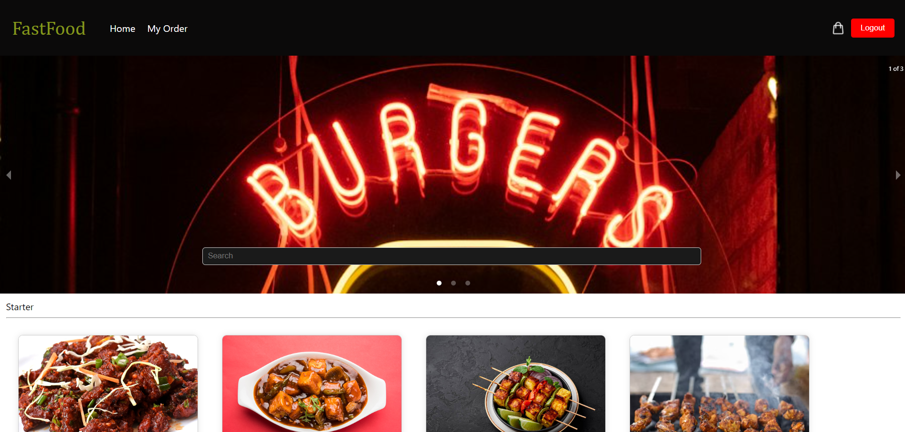

# Fast Food MERN App
Description
The Fast Food MERN App is a web application built using the MERN stack, allowing users to browse and order fast food items online.

## Table of Contents

* [Features](#features)
* [Technologies](#technologies)
* [Installation](#installation)
* [Usage](#usage)
* [Contributing](#contributing)

## Features
User Authentication: Users can create accounts, log in, and authenticate their sessions.

Browse Menu: Browse a variety of fast food items categorized by type.

Ordering System: Add items to the cart and place orders.

My order: User can View their order history.

## Technologies

### Frontend:
React: A JavaScript library for building user interfaces.

Redux: State management for React applications.

React Router: Navigation for React apps.

### Backend:
Node.js: JavaScript runtime for server-side development.

Express.js: Web application framework for Node.js.

MongoDB: NoSQL database for storing application data.

Mongoose: ODM (Object Data Modeling) library for MongoDB and Node.js.

### Authentication:
JSON Web Tokens (JWT): Securely transmit information between parties.

### Installation
Clone Repository:

bash

Copy code

git clone https://github.com/harshKumar029/cloudkitchen_mern.git

open file location

Install Dependencies:

bash

Copy code

Install server dependencies

npm install

Install client dependencies

npm install

Start the server (from the server directory)
nodemon index

Start the client (from the client directory)

npm start

Visit http://localhost:3000 in your browser.

### Usage
Register/Login:Create a new account or log in using existing credentials.

Browse Menu:Explore the menu and add items to your cart.

Place Order:Review your order in the cart and proceed to checkout.

### Contributing
Contributions are welcome! Please follow the github contribution guidelines when submitting pull requests.
